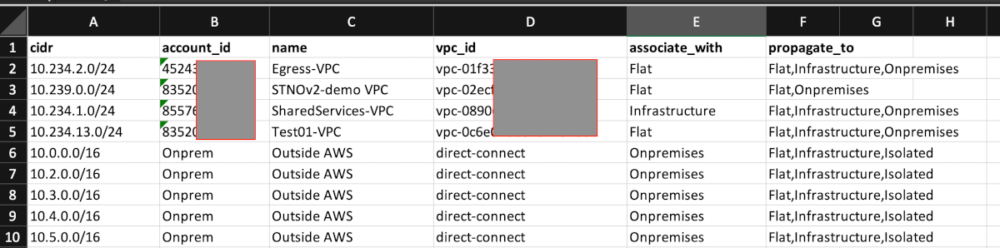
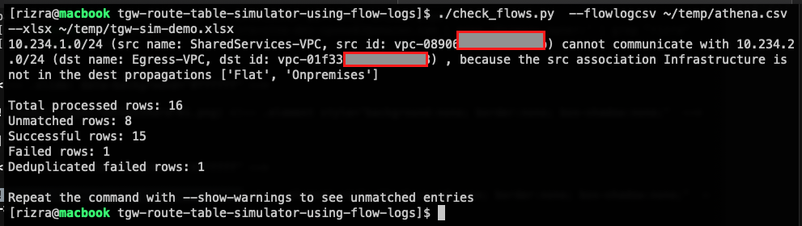

# (Python Script) AWS Transit Gateway route table simulator, using Amazon VPC Flow Logs

This script checks if a given [Amazon Virtual Private Cloud (VPC)](https://aws.amazon.com/vpc/) [Flow Log](https://docs.aws.amazon.com/vpc/latest/userguide/flow-logs.html) has every flow allowed based on an [AWS Transit Gateway](https://aws.amazon.com/transit-gateway/) [associations/propagations](https://docs.aws.amazon.com/vpc/latest/tgw/how-transit-gateways-work.html#tgw-routing-overview) configuration in a Microsoft Excel file. You create a plan of the associations/propagations per VPC in an Excel sheet, and the script will take a summarized VPC flow log file, run it through it's simulation of Transit Gateway route tables based on your plan, and report if a flow would fail with the given configuration.

This is useful if you plan to change your Transit Gateway route tables, and want to verify that you would not break previously-working network flows with your new design. This can even handle complex designs of more than 30 TGW route tables. Note that this does not simulate firewalls, virtual appliances, or Transit Gateway peering, and only works if your VPC CIDRs are >= /24.

The initial Excel file can be generated automatically (except for the route table associations/propagations, and onpremises CIDR ranges) if you have a centralized AWS Config setup, or can be manually created:



You then use the given script to summarize the VPC flow logs in an S3 bucket across a date range to a CSV file (using Athena). That CSV, and the Excel file, is then used as inputs to the main script, which will report on any failed flows:



The algorithm is fast, so in most cases the script should take just a few seconds to run even with large VPC flow logs or Excel sheets.


## One time setup

### Initial network configuration Excel file

The main script takes an input of an Excel file with the following columns:

-----------------------------------------------------------------------------
| cidr | account_id | name | vpc_id | associate_with | propagate_to |
|----------|------------|----------|--------|----------------|--------------|
| 10.123.0.0/23 | 0123456789 | Some VPC | vpc-abcd12345 | Infrastructure | Flat,Infrastucture,Onpremises |
| 10.234.0.0/24 | None | Datacenter | None | Onpremises | Flat,Infrastucture,Prod-Flat |
| ... | ... | ... | ... | ... |

While the Associate_with and Propagate_to needs to be configured manually later, the initial CSV with the VPCs can be generated from a AWS Config JSON output of VPC resources using the script `generate_network_csv_from_config_json.py`:

- In the [AWS Config Aggregator](https://docs.aws.amazon.com/config/latest/developerguide/aggregate-data.html) account (eg. Audit account in Control Tower), go to AWS Config and Advanced Queries. Make sure you select the centralized aggregator, and run the query:

```sql
select resourceId,  configuration.cidrBlock,  configuration.tags,  accountId where  resourceType = 'AWS::EC2::VPC'
```

and export it as a JSON, and save it somewhere locally.

- Run the `one_time_step/generate_network_xlsx_from_config_json.py` script:

```bash
input=/path/to/the/config.json
output=/path/to/write/the.xlsx
./one_time_step/generate_network_xlsx_from_config_json.py --configjson $input --output $output
```

Then edit the associate_with and propagate_to columns based on your design.


### VPC Flow Log summary CSV

This script will create an Athena table and partition on the account you are running on.

Set your `AWS_PROFILE` to an account that can access the VPC Flow Logs S3 bucket.

Edit the `process_vpc_flog_logs.py` file with the S3 bucket name (`S3_BUCKET=`), and start/end dates, a bucket for temporary Athena files (`S3_ATHENA_BUCKET`, can be the same as the VPC flow log bucket), the `REGION`, and the output file name.

Run the script with `./process_vpc_flog_logs.py`. 


## Running the check:

This can be run as many times as needed:

```bash
./check_flows.py  --flowlogcsv location/of/athena.csv  --xlsx data_files/network_configuration_plan.xlsx
```

## Security

See [CONTRIBUTING](CONTRIBUTING.md#security-issue-notifications) for more information.

## License

This library is licensed under the MIT-0 License. See the LICENSE file.

